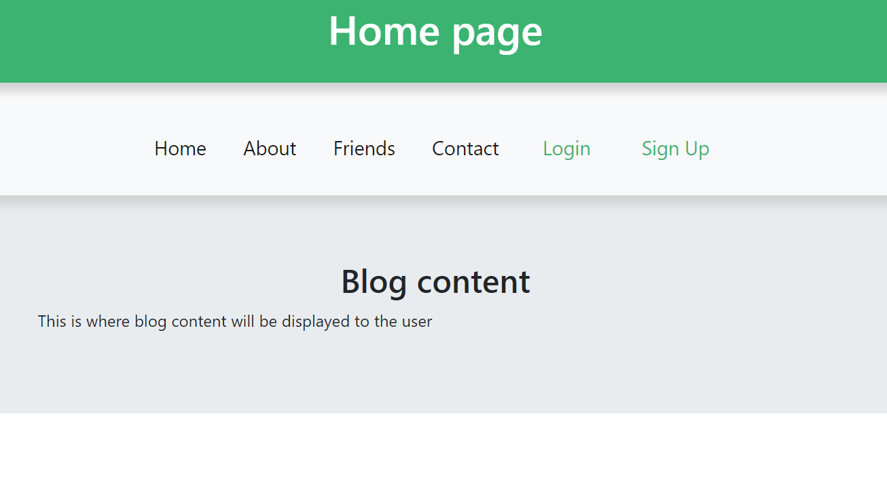
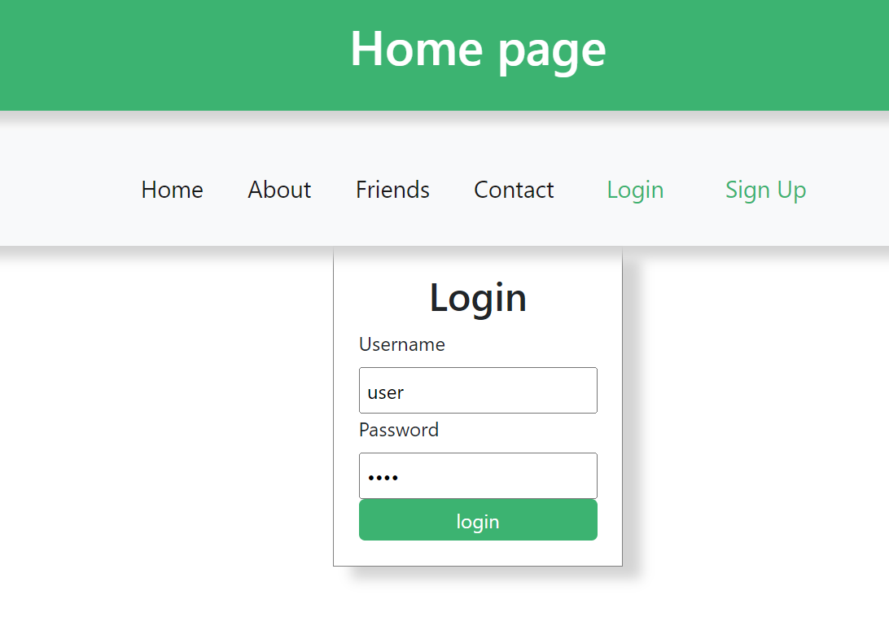
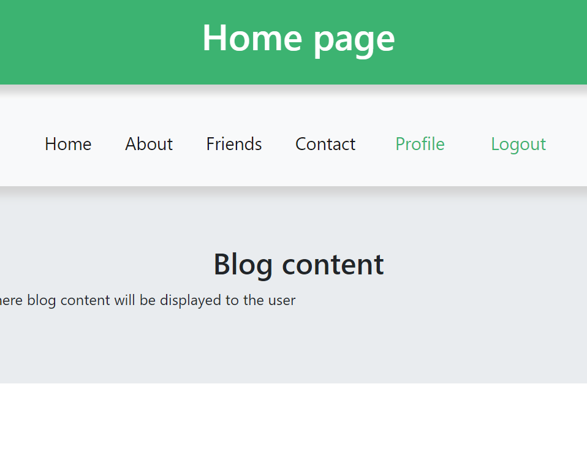

1. A blog website that allows users to make accounts and login as well as create posts.

2. problems with connecting to database, using local storage

3. Frontend: CSS, Bootstrap, Fontawesome 
   Backend: javascript, express, Mysql, Node

4. 

5. First download node and node package manager. After downloading the project in the root of the project run the npm install command. To start the express server use the command npm run dev, the server will start on local host 3000.

6.

